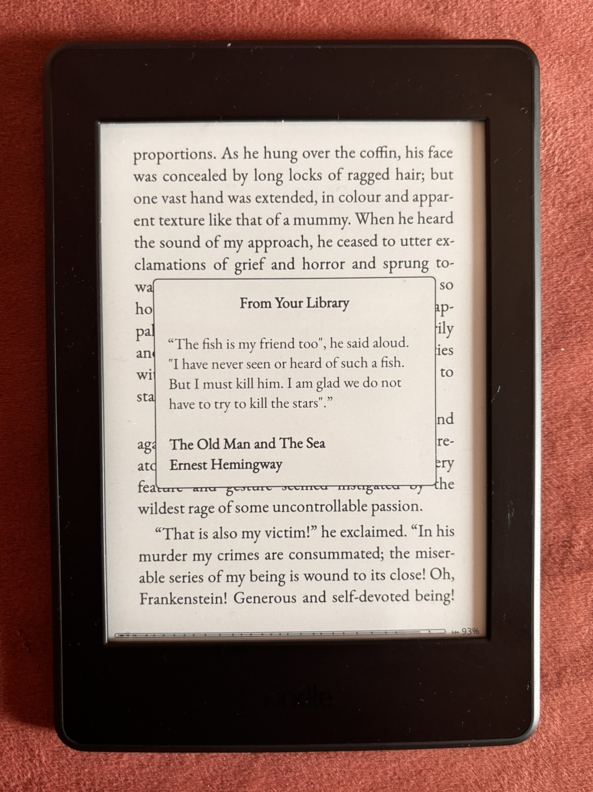
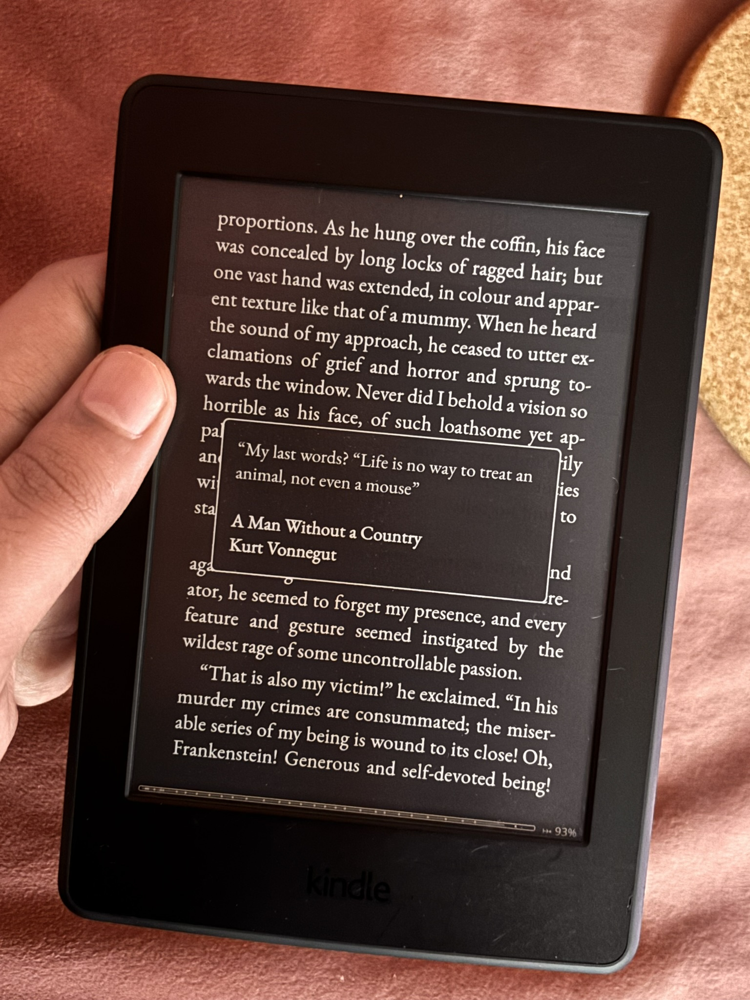
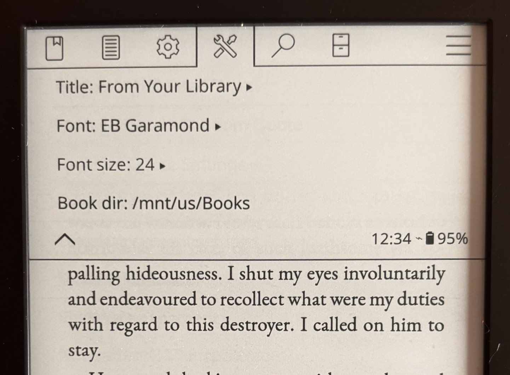

# Random Quotes for KOReader

A KOReader plugin that displays a random quote from your own highlighted texts in a small pop-up when you unlock. It extracts \[and maintains\] a local quote library from your highlighted texts, and provides settings to control appearance and behavior of the widget.

## Features

- Shows a random quote in a lightweight `QuoteWidget` with basic formatting (bold/\[italic\]/alignment).
- Extracts quoted/highlighted texts from book metadata into the plugin's local library.
- Settings to specify appearance and library directory.

## Screenshots

## Installation

This is the initial public release of the plugin.

1. Download the `randomquote.koplugin-vx.x.x.zip` file from the latest release in [release page](https://https://github.com/DenisovichDev/randomquote.koplugin/releases).
2. Extract the files and paste the `randomquote.koplugin` folder into your KOReader `plugins` directory (`koreader/plugins/`, the `koreader` directory will depend on your device).
3. Restart your KOReader.
4. Make sure the plugin is enabled (`Settings Menu -> More Tools -> Plugin Management -> Make sure Random Quote is ticked`)

## Usage

- Open KOReader → More Tools → Random Quote Options.
- Select **Random Quote Settings** provide the location to all your books, and customize the appearance of the widget. 
- Use **Extract Highlighted Texts** to scan the configured book directory and add discovered highlights into the plugin's library.
- Try **Debug: Show A Random Quote** to preview a random quote immediately.
- The plugin shows a random quote when resumed or activated, using the configured font and appearance settings.

## Settings

Access these under More Tools → Random Quote Options → Random Quote Settings.

- Title: choose between the default title, no title, or enter a custom title string.
- Font face: select a font face; the plugin attempts to resolve and use the requested face.
- Font size: choose the display size used by the `QuoteWidget`.
- Book directory: path scanned when extracting highlights (default: `/mnt/us/Books`).

## Advanced / Curating the Library

The plugin stores its quote library in the plugin folder as `quotes.lua` and updates it when you run extraction. Advanced users can directly edit the `quotes.lua` if they wish. Placeholders are given in the file in this repo for you to check.

## Troubleshooting

- No quotes shown: run **Debug: Show A Random Quote** to confirm runtime behavior. If extraction found no entries, ensure `Book dir` points to the correct folder and that book metadata sidecars exist.
- Extraction failures: malformed metadata files may prevent extraction; check KOReader logs for errors related to loading metadata files.
- If you are unsure, file an Issue in this GitHub repo.

## Compatibility

- Should work with all compatible devices. I have only checked with my Kindle PW3. If you use it and it works in your device as expected, let me know.

## License

AGPL-3.0-or-later (same license as KOReader).

## Contributing

Contributions and issues are welcome. Open an issue if you find a bug or want a new feature. If you can help me make this better, make sure to do a Pull Request.
